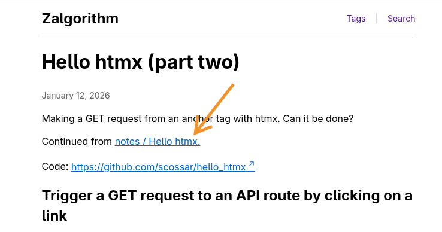
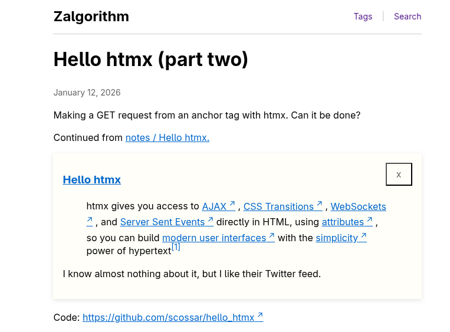
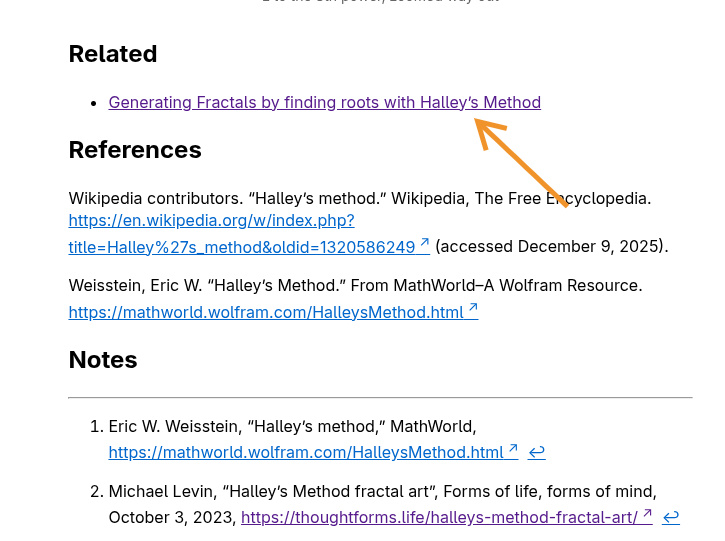
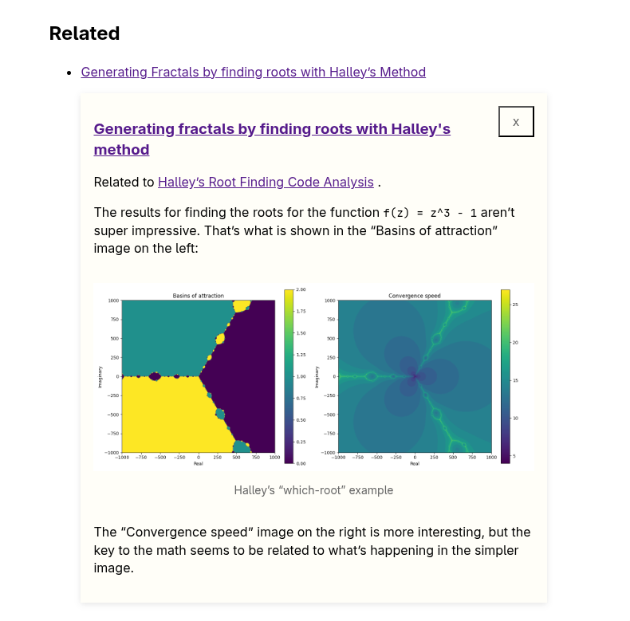

# Hello htmx

NOTE: I'm just fooling around with this.

There's a working demo at [https://zalgorithm.com/notes/hello-htmx2/](https://zalgorithm.com/notes/hello-htmx2/) and [https://zalgorithm.com/search/](https://zalgorithm.com/search/) though.

